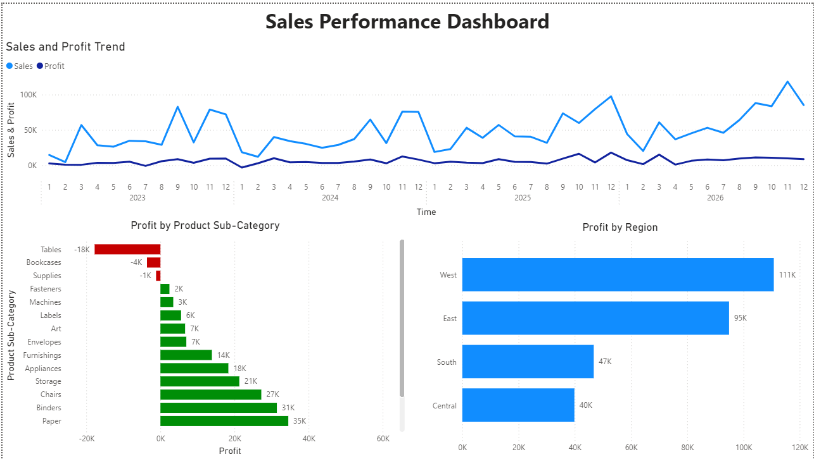
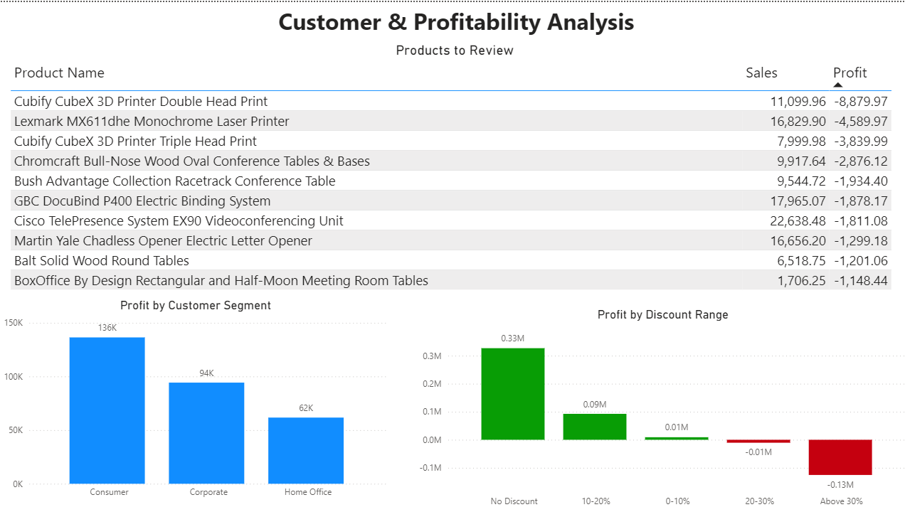

# Sales Performance Analysis

An end-to-end data analytics project that analyzes retail sales performance using **Python**, **DuckDB**, **SQL**, and **Power BI**. The project transforms raw transactional data into business insights through SQL analysis and interactive dashboards, helping identify revenue trends, profitability drivers, and areas requiring improvement.

---

## Project Overview

Retail businesses often experience strong sales growth without a proportional increase in profitability. The objective of this project is to analyze historical sales data, identify the factors influencing revenue and profit, and present actionable insights through a Power BI dashboard.

The analysis focuses on answering key business questions related to sales trends, product performance, customer segments, regional performance, discount strategies, and loss-making products.

---

## Tech Stack

- Python (Pandas)
- DuckDB
- SQL
- Power BI
- Git & GitHub

---

## Project Structure

```text
sales-performance-analysis/
│
├── data/
│   └── Sample_Superstore.xls
│
├── database/
│   └── sales_performance.duckdb
│
├── images/
│   ├── dashboard_overview.png
│   └── dashboard_analysis.png
│
├── powerbi/
│   ├── category_performance.csv
│   ├── customer_segment_performance.csv
│   ├── discount_analysis.csv
│   ├── products_to_review.csv
│   ├── regional_performance.csv
│   ├── sales_trend.csv
│   └── sales_performance_dashboard.pbix
│
├── scripts/
│   └── load_data.py
│
├── sql/
│   └── queries.sql
│
├── README.md
└── requirements.txt
```

---

## Data Pipeline

The project follows a simple end-to-end analytics workflow.

```
Excel Dataset
      │
      ▼
Python (Data Loading & Cleaning)
      │
      ▼
DuckDB Database
      │
      ▼
SQL Business Analysis
      │
      ▼
CSV Exports
      │
      ▼
Power BI Dashboard
```

---

## Business Questions

The analysis answers the following business questions:

1. How have sales and profit changed over time?
2. Which product categories and sub-categories generate the highest revenue and profit?
3. How does business performance compare across different regions?
4. How do customer segments differ in revenue, profitability, and purchasing activity?
5. How do discounts impact profitability?
6. Which products generate high sales but low or negative profit?

---

# Dashboard

## Executive Overview



The first dashboard page provides a high-level view of overall business performance by analyzing sales trends, product profitability, and regional performance.

---

## Customer & Profitability Analysis



The second dashboard focuses on customer segments, discount effectiveness, and products that require immediate business attention.

---

# Key Insights

### Sales Performance

- Sales exhibit recurring seasonal peaks, with stronger performance during the later months of each year.
- Profit follows the sales trend but grows at a slower rate, indicating opportunities to improve profitability.

### Product Performance

- Chairs, Paper, and Binders are among the strongest profit-generating product groups.
- Tables, Bookcases, and Supplies consistently generate losses despite contributing to overall sales.

### Regional Performance

- The West region generates the highest overall profit.
- The Central region produces the lowest profit, indicating opportunities for operational improvement.

### Customer Segments

- The Consumer segment contributes the highest overall profit.
- Home Office contributes the lowest profit among the three customer segments.

### Discount Analysis

- Orders without discounts generate the highest overall profit.
- Profitability declines as discount levels increase.
- Discounts above 30% are associated with significant losses.

### Products to Review

Several products generate substantial revenue while consistently producing negative profit, indicating the need for pricing and profitability review.

---

# Business Recommendations

Based on the analysis, the following recommendations are proposed:

- Review pricing and discount strategies for Tables, Bookcases, and Supplies, as these product categories generate losses despite contributing to sales.
- Reassess discount policies above 20%, since higher discount levels are associated with declining profitability.
- Replicate successful sales and product strategies from high-performing regions and profitable product categories while implementing targeted improvement plans for lower-performing areas.

---

# Skills Demonstrated

This project demonstrates practical experience with:

- Data cleaning using Python and Pandas
- Building analytical databases using DuckDB
- Writing SQL for business analysis
- Aggregation and reporting
- Business KPI analysis
- Dashboard design using Power BI
- Translating analytical findings into business recommendations
- Git and GitHub project organization

---

# Future Improvements

Potential enhancements include:

- Direct Power BI connection to DuckDB without CSV exports
- Interactive dashboard filters and slicers
- Customer-level profitability analysis
- Year-over-Year and Month-over-Month growth analysis
- Automated data refresh pipeline

---

## Author

**Sri Harsha Navundru**

If you found this project interesting, feel free to explore the repository or connect with me.